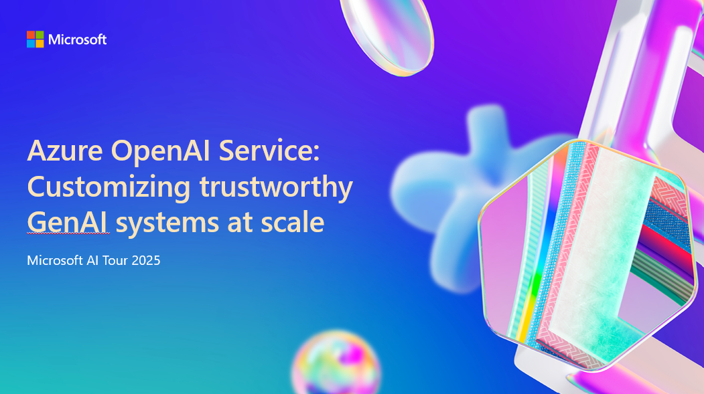

# BRK351: Azure Open AI Service: Customizing trustworthy Gen AI systems at scale

## Session Desciption
It’s ‘year two’ for generative AI and the pace of innovation since launching Azure OpenAI only continues to skyrocket. With 60,000+ customers using Azure AI today and expanding capabilities across the platform, this is the session where we’ll decode the latest news and distill which patterns are making real waves. From powerful performance with speech, vision, and language, to simplified fine-tuning and built-in safety tools, Azure OpenAI lets you build without boundaries.

## Session Resources

| Resources          | Links                             | Description        |
|:-------------------|:----------------------------------|:-------------------|
| BRK351 English PPT Presentation | [Link 1](https://aka.ms/AAu3t5z) | Full presentation deck in US English|
| BRK351 Korean PPT Presentation  | [Link]| Full presentation deck in Korean -- Coming soon|
| BRK351 Japanese PPT Presentation  | [Link]| Full presentation deck in Japanese -- Coming soon|

## Content Owners
Nikisha Reyes-Grange, Director of Product Marketing, Microsoft

